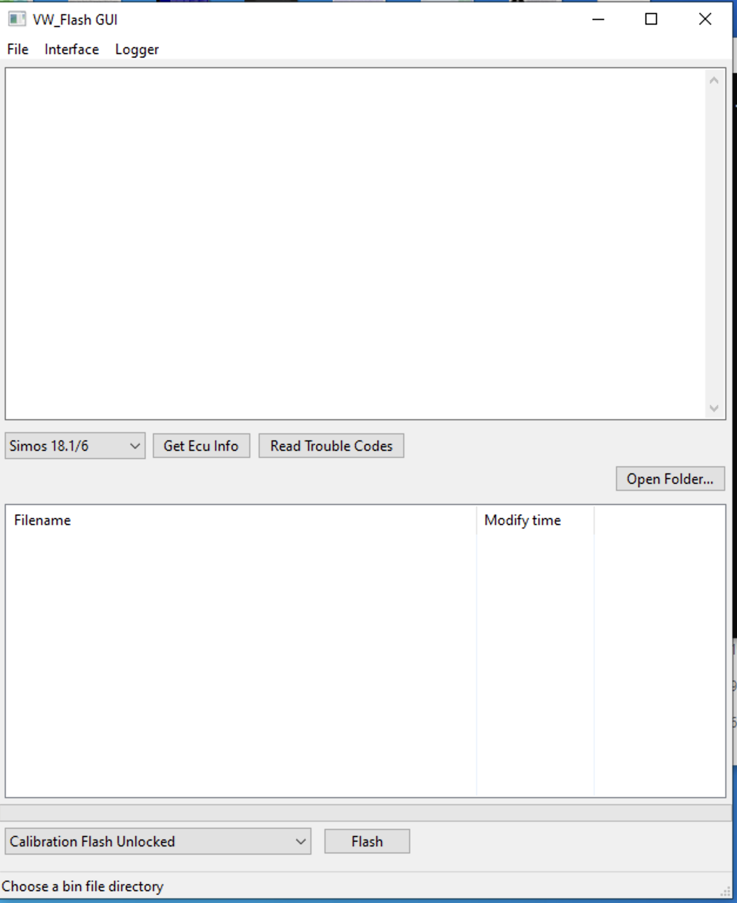
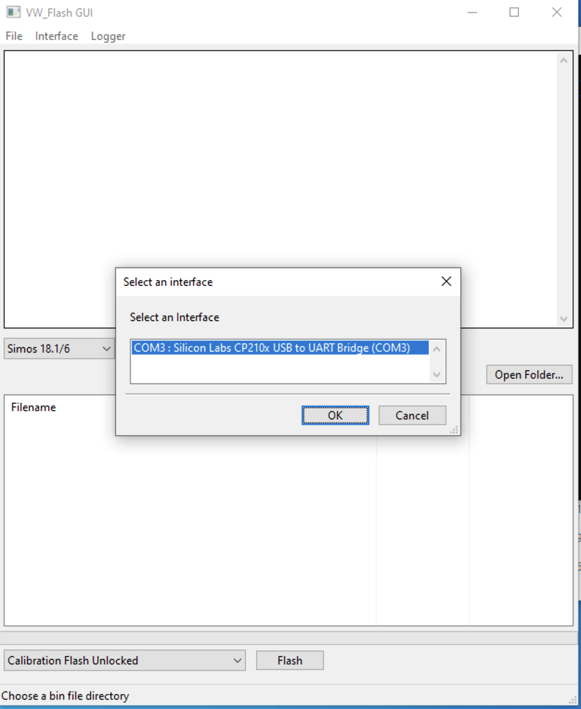
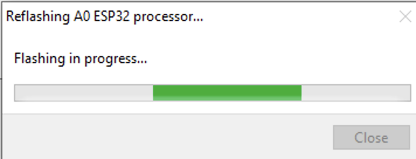
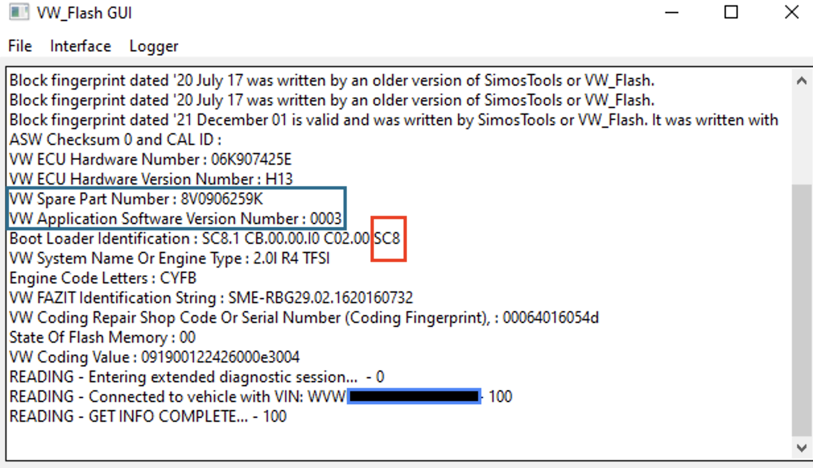
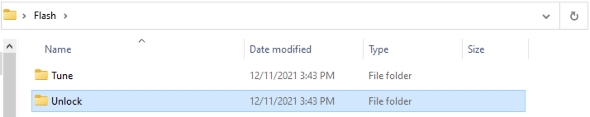
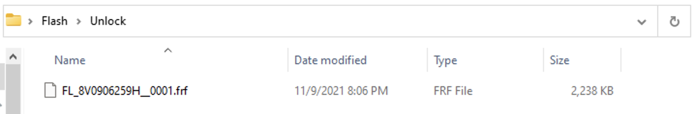
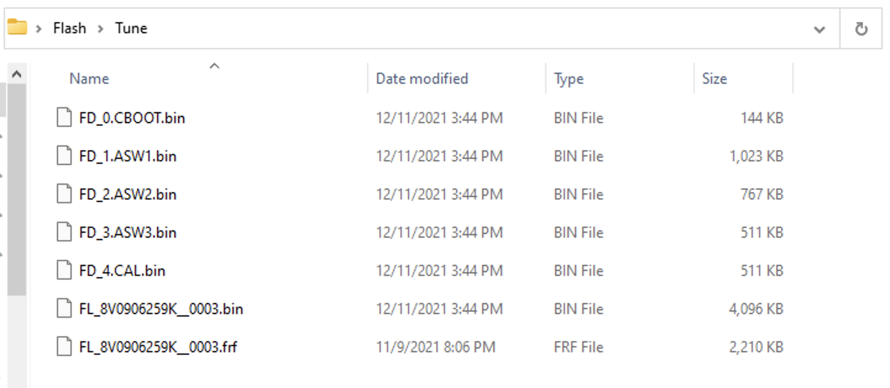
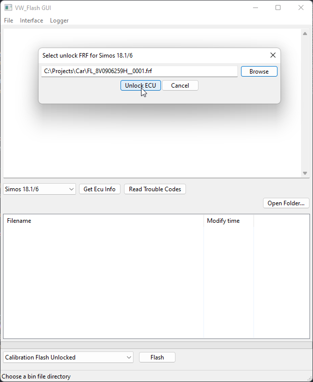
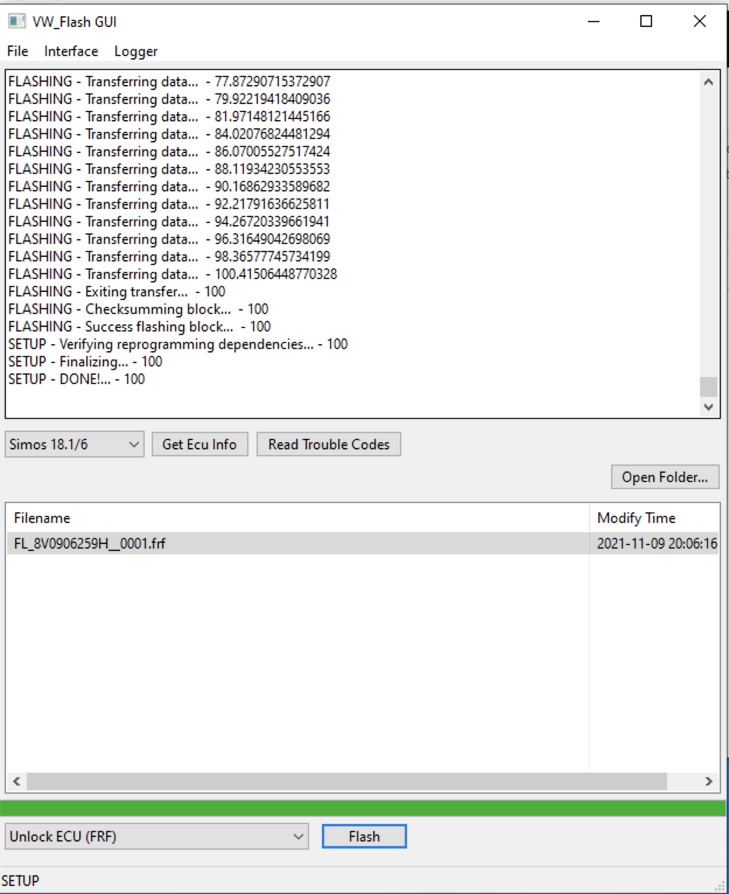
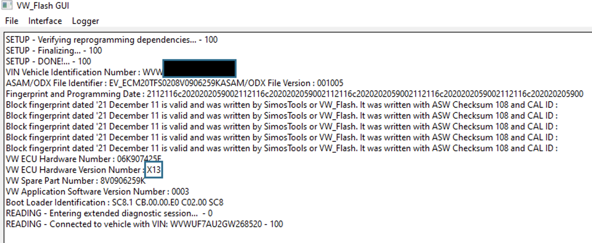

# Ingredients

* Supported Hardware: Macchina A0 or Tactrix OpenPort (genuine).
* FRF files (Flashdaten) - see below.
* VW_Flash_GUI distribution package from ["Releases"](https://github.com/bri3d/VW_Flash/releases) on GitHub.

# Setting up your Hardware

* For Tactrix OpenPort, install the latest OpenPort drivers from here: https://www.tactrix.com/index.php?Itemid=61
* For Macchina A0, plug in your A0 using a MicroUSB cable. Check in the Windows Device Manager for a "Silicon Labs CP210x USB to UART Bridge" device. If it has an exclamation point next to it, download the CP201x drivers from here: https://www.silabs.com/documents/public/software/CP210x_Universal_Windows_Driver.zip and install the drivers using the "Have Disk..." option in the Windows Device Manager.

# Reflashing the A0 (required for A0)

* Open the VW_Flash_GUI application. You should see a command window as well as the application GUI.

* Open the Interface menu and choose Select Interface.

* Pick the interface which reads "Silicon Labs CP210x USB to UART Bridge."
* Open the Interface menu again and select Reflash A0

* Wait for the dialog to disappear. If it does not, check the black command prompt window for errors, restart the application, and try a better MicroUSB cable.

# Picking an interface

* Open the VW_Flash_GUI application. You should see a command window as well as the application GUI.
* Open the Interface menu and choose Select Interface.
* To use an A0 over serial, pick the interface which reads "Silicon Labs CP210x USB to UART Bridge."

* To use an A0 over Bluetooth, pick the interface which reads BLE_TO_ISOTP.
* To use J2534 / OpenPort, pick the J2534 interface you'd like to use. 

# Getting information

* It's time to get in the car. Turn the ignition on without starting the engine. Make sure a key is in range. On 2020 model year cars, you may also need to open the hood.
* Click Get ECU Info.
* You should now see information in the information area. If you don't, verify that your A0 has the correct firmware and/or you've selected the right interface. Counterfeit OpenPort cables are not supported and unreliable, and other J2534 interfaces are completely untested. 

* The most important things to check for now are the Boot Loader Identification. If the last 3 letters are `SC8`, you have a Simos18.1 ECU. If the last 3 letters are `SCG`, you have a Simos18.10 ECU.
* Next, check your current VW Spare Part Number and VW Application Software Version Number. Note these for later.
* You're done in the car for now. Go back inside. You've confirmed that your hardware interface works, and you have the information you need to continue.

# Getting files

Create a new folder on your PC to store the files you'll be using. Make two folders inside of this one: Unlock and Tune.

First, you need a specific file that VW_Flash will use to unlock your ECU. Please don't get clever and download a different file for this part of the process. Just use the specified file for the Unlock process:

* If your Boot Loader Identification said SC8, you need `FL_8V0906259H__0001.frf`.
* If your Boot Loader Identification said SCG, you need `FL_5G0906259Q__0005.frf`

Put this file in the Unlock folder.

Simos18 ECUs, like most modern ECUs, do not implement support for reading the flash memory from the ECU over the OBD port. So instead, we need to convert update files from VW's servers (called FRF files) into .BIN files we can use to tune the car. 

It's essential that you download an FRF file that matches your car's Power Class.

For US market cars, we've prepared an "update matrix" which will install a specific software version (SC800S50) on your car for which we have both definition (XDF) and various patch files.

US Golf R / S3, if your VW Spare Part Number matches 8V0906259B, 8V0906259E, 8V0906259H, or 8V0906259K: `FL_8V0906259K__0003.frf`
US GTI/A3 2.0, if your VW Spare Part Number matches 5G0906259A, 5G0906259D, 5G0906259L: `FL_5G0906259L__0002.frf`
US 1.8T (Sportwagen, Golf, A3 1.8), if your VW Spare Part Number matches 8V0906264A, 8V0906264D, 8V0906264F, 8V0906264K, 8V0906264L, 8V0906264M: `FL_8V0906264K__0003.frf`
US TT-S, if your VW Spare Part Number matches 8S0906259C: `FL_8S0906259C__0004.frf`

If you don't have one of these box codes (for example, you are not in the US), you need to locate an update file which matches your VW Spare Part Number and VW Application Software Version Number. Or, you can locate a newer update file to work off of.

# Making a "virtual read" .BIN file to flash your ECU with

* Open the VW_Flash_GUI.exe.
* Pick File -> Extract FRF...
* Pick the FRF file you put in the Tune folder above.
* Pick the Tune folder.
* Wait a few seconds.

Open up the Tune folder and you should see the following:

The FL_xxx_x.bin file is a "full read" of your ECU, which can be used with file patching and tuning services like VehiCAL.
The FD_4.CAL.bin file is the "calibration" segment of your ECU, which can be used with some tuning tools.
The other .bin files are other segments of your ECU, for advanced tuning use.

# Making sure everything is ready

In your Unlock folder, you should have either `FL_8V0906259H__0001.frf` or `FL_5G0906259Q__0005.frf`.
In your Tune folder, you should have a `FL_XX_XX.bin` file *matching your car*, either directly or via the compatibility matrix above. For example, for my USDM Golf R I have `FL_8V0906259K__0003.bin` .

# Let's go!

# Unlocking the ECU

* Set aside at 2 hours where you won't need your car. The full unlocking process takes about 30 minutes, but if something goes wrong, you'll want time to troubleshoot and return to stock. After you've done this once, flashing a new tune (Calibration) takes about 20 seconds.
* To be safe, it's recommended that your car be on a battery tender, but not required. Same for your laptop.
* Enter the car. Turn the ignition on, but the engine off. Ensure the key is in range.
* Pick Get Info again to make sure your hardware interface is still working.
* Pick "Open Folder..." and navigate to your Unlock folder.
* Select "Unlock" from the dropdown next to the Flash button.

* Click "Flash."
* Wait a long time. You should see continuous progress updates as the process proceeds.
* When the process is complete, you should see Finalizing... and then DONE messages in the information box.

* Now click Get Ecu Info again. Check the VW Hardware Number. It should have changed to X13. If it did, congratulations. Your ECU is now in a Sample Mode bootloader and ready to take new software.

*At this point, your car will not start or run. It is in a patched bootloader, without any software. You now need to install software on it.*

# Flashing your new software.

* Pick "Open Folder..." and navigate to your Tune folder.
* Pick "Full Flash Unlocked (BIN/FRF)".
* Pick the `FL_XX_XX.bin` file matching your car. 
* Pick Flash.

* Wait a little less time than you had to last time. When the process is complete, you should see Finalizing... and then DONE messages in the information box.
* Now click Get Ecu Info again. Check the VW Spare Part Number. It should have changed to the box code you selected for flashing.

# Your ECU is now unlocked and ready to tune!

From here on out, your car will accept unsigned software blocks. You can select `Calibration Flash Unlocked` to flash only a modified Calibration area, which should take only 20 seconds or so. If you have a modified BIN from a fileservice like VehiCAL, you can flash it using "Full Flash Unlocked" again. 

# If something goes wrong!

Don't panic. It is almost impossible to brick an ECU using this process. The only way to cause major problems is to flash a file for a car from the wrong country without a matching Power Class, due to a bug in the immobilizer. For most other issues you can imagine, for example, if power is interrupted, the system crashes, or the connection is broken, you can always safely repeat an operation until it works. For example, if your Unlock process is interrupted, simply try again.

The best thing to do if something goes wrong, you've tried repeating the failed operation, and you're desperate, is to have a stock `FL_XXXX_XXX.frf` file available for your car. Simply select Flash Stock (Re-Lock) and pick your stock FRF. Click Flash, and allow the process to complete. Your car will be re-locked but it will run again. 

# Troubleshooting

Feel free to open a GitHub issue, but you MUST include the following 3 files if you want help:

`flash.log` , `flash_details.log`, and `udsoncan.log` . If you don't provide these 3 files (or you take phone pictures of your screen or some other ridiculous thing), I can't help you because I don't have information about what went wrong.

